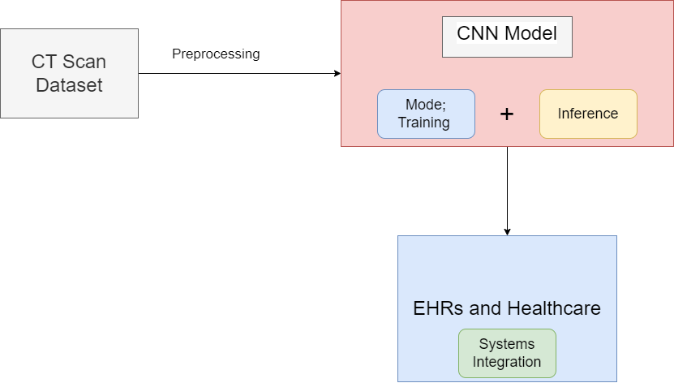
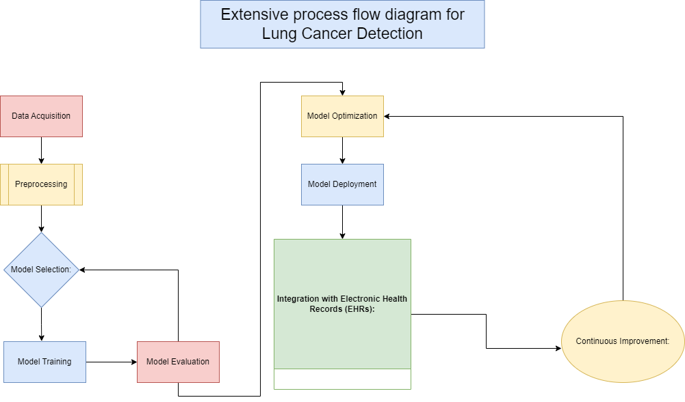

# intel-oneAPI

#### Team Name - Lightspeed
#### Problem Statement - Lung cancer prediction using Convolutional Neural Networks (CNN)
#### Team Leader Email - saikiran@lightspeedphotonics.com

## A Brief of the Prototype:
  This section must include UML Daigrms and prototype description

## Tech Stack: 
   Intel’s OneAPI Jupyter Lab
   Python
   Intel GPUs (Devcloud)

## Step-by-Step Code Execution Instructions:
  This Section must contain set of instructions required to clone and run the prototype, so that it can be tested and deeply analysed

## What I Learned:
   Write about the biggest learning you had while developing the prototype